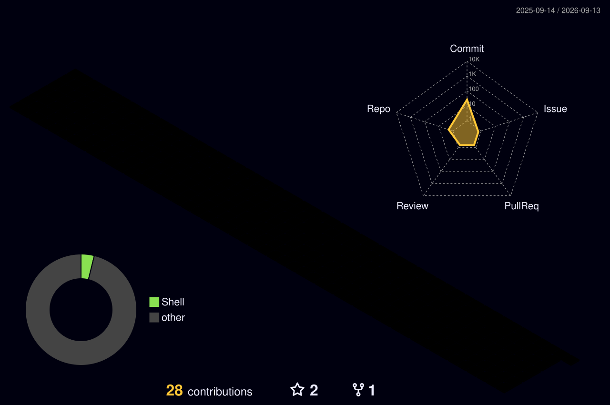

# 👋 Hi, I'm Mohamed Amine Staali

### DevOps Engineer | Cloud (AWS) & AI Infrastructure

DevOps engineer with a strong foundation in **Mathematics**, **Computer Science**, and **Professional Communication**, currently focusing on **DevOps**, **cloud infrastructure**, and **production-grade AI systems**.

I specialize in designing and building **scalable**, **reliable**, and **production-ready systems**, with a strong emphasis on automation, system design, and efficient infrastructure orchestration.

## 💫 About Me

- ☁️ DevOps & Cloud Infrastructure Engineering
- 🧱 Backend Systems & Distributed Architecture
- 🤖 Agentic AI Systems
- 🔁 CI/CD Pipelines & Automation
- ⚡ Scalable AI-powered Applications

## 🚀 Currently

- Building AI-driven platforms and tools
- Maintaining and improving system infrastructure
- Designing system architectures for diverse real-world solutions

---

## 🌐 Socials

---

## 🕹️ My Contributions, Gamified

Every push, merge and commit — reimagined as a space battle. Regenerated daily by GitHub Actions.

  

---

## 🧱 3D Contribution Graph

  

---

## 💻 Tech Stack

### ⚡ Core Toolkit

### ☁️ DevOps & Cloud
 

  
  
  
  
  
  
  
  

  

 
### 🧠 AI / ML
 

 
### 🛢️ Databases
 

### ⚙️ Programming Languages
 

  
  
  
  
  
  

### 🧠 Methodologies

---

## 📊 GitHub Stats

---

*Building scalable systems that work — not just in theory, but in production.*

